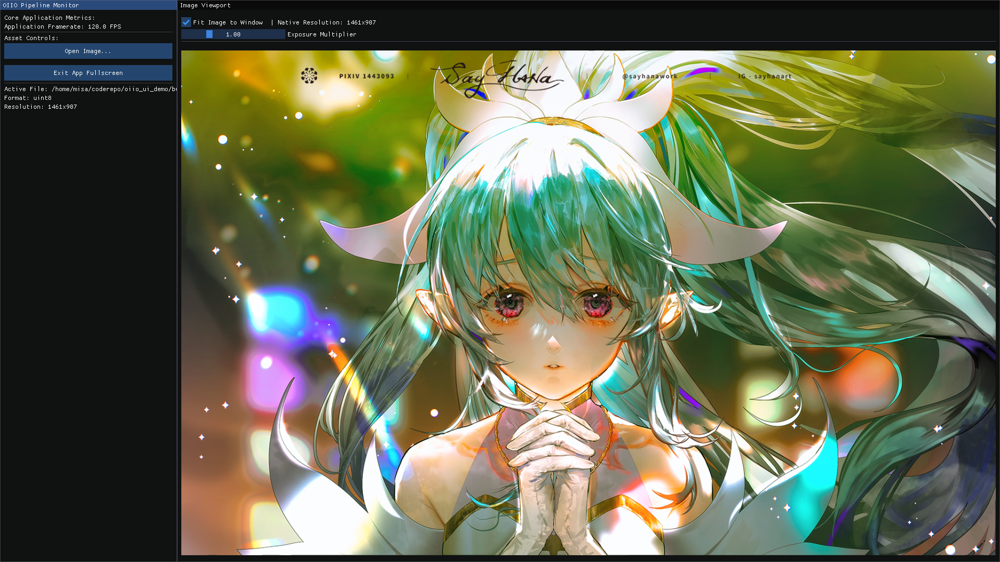

# OpenImageIO ImGui Viewer (iv Clone)

This is a lightweight, hardware-accelerated viewer built using [Dear ImGui](https://github.com/ocornut/imgui), designed as a modernized, minimal proof-of-concept clone of OpenImageIO's `iv` tool.

The goal of this project is to decouple the core viewing and image processing logic from heavy UI frameworks (like Qt) while maintaining the rich, professional feature set expected of `iv`, including advanced exposure controls and OpenColorIO color management.

## Features

* **GPU-Accelerated Processing:** Exposure, Gamma, and Channel Masking (R, G, B, Alpha, Luminance) are computed dynamically inside an OpenGL Fragment Shader, removing CPU bottlenecks and ensuring instantaneous visual updates even on 4K/8K images.
* **OpenColorIO (OCIO) Integration:** Fully supports OCIO v2. When enabled (and an `$OCIO` environment variable is present), the application dynamically generates GLSL shader snippets and binds 3D/1D Look-Up Tables directly to the GPU for accurate, industry-standard color space rendering.
* **Zero-Cost Orientation:** Rotating (90°, 180°, 270°) and Flipping (Horizontal, Vertical) the image is applied as pure mathematical UV coordinate manipulation in the shader, avoiding expensive buffer reprocessing.
* **Modern UI/UX:** A custom flat, dark-themed ImGui interface. All controls are neatly tucked into a side "Pipeline Monitor" panel, leaving the rest of the window completely unobstructed for the image viewport.
* **Native OS Dialogs:** Seamlessly open and save images using your operating system's native file dialogs.
* **Interaction & Probing:** Infinite middle-click style panning, smooth scroll-wheel zooming, and a hover-over Pixel Probe that displays the raw (unclamped) floating-point data of the pixel under the cursor.

## Screenshots




## Dependencies

* **OpenImageIO (OIIO)** (System installed)
* **OpenColorIO (OCIO)** (System installed)
* **GLFW** (System installed, handles Window/Context creation and input events)
* **Dear ImGui** (Vendored)
* **GLAD** (Vendored, OpenGL 4.1 Core Profile)
* **NativeFileDialog-Extended (NFD)** (Linked via CMake for native open/save dialogs)

## Building the Project

Ensure you have the required dependencies installed (e.g., via `pacman`, `apt`, or `brew` depending on your OS).

```bash
mkdir build
cd build
cmake ..
ninja
```

## Running the Viewer

To run the application normally:
```bash
./build/oiio_ui_demo
```

**To use OpenColorIO:**
If you have an OCIO configuration file (such as an ACES config) and want to see the advanced Color Space, Display, and View dropdowns populate, make sure the environment variable is set before running:

```bash
export OCIO=/path/to/your/config.ocio
./build/oiio_ui_demo
```
*(If `$OCIO` is not set, the application will fallback to a minimal built-in config featuring only `raw` and `sRGB`)*

## Code Architecture

* `main.cpp`: Initializes SDL3, OpenGL, and ImGui. Applies the custom dark theme and handles the main application loop and UI panel rendering.
* `Viewer.cpp / Viewer.h`: The core logic class. Encapsulates `OIIO::ImageBuf` memory management, OpenGL Texture creation, interaction state (pan/zoom/rotate), and the custom Fragment Shader.
* `OcioHelper.cpp / OcioHelper.h`: A robust abstraction around OCIO's `GpuShaderDesc`. It handles requesting dynamic GLSL snippets from the OCIO API and binding the required hardware texture LUTs.
* `Shader.h`: A tiny wrapper for easily compiling the Vertex and Fragment shaders.
